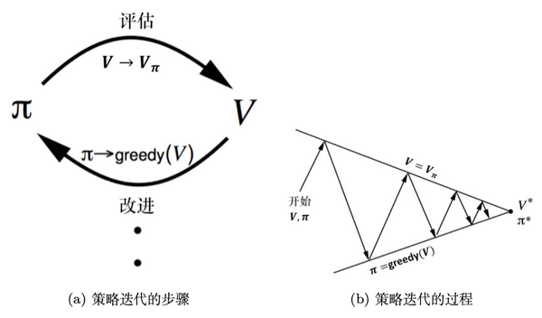
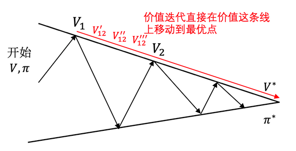

# 第二章
## 练习题
1. 强化学习所解决的问题一定要严格满足马尔可夫性质吗？请举例说明。
    1. 马尔可夫性质是给定历史状态中，下一个状态只和当前的状态有关，与历史状态无关。
    1. 所以强化学习不一定满足马尔可夫性质, 棋类游戏中不仅和当前的状态有关, 还和历史的状态有关
1. 马尔可夫决策过程(MDP)主要包含哪些要素？
    1. 主要包含5个要素$\langle S,A,R,P,\gamma \rangle$
    1. S: state状态，A：action动作，R：reward奖励, P: 概率转移矩阵, $\gamma$ 折扣因子
    1. 这里和wiki上不相同，wiki上是4个元素$(S,A,P_{a},R_{a})$
1. 马尔可夫决策过程与金融科学中的马尔可夫链有什么区别与联系？
    1. 马尔可夫链 + reward = 马尔可夫奖励过程
    1. 马尔可夫奖励过程 + state = 马尔可夫决策过程

# 第三章
## 练习题
1. 动态规划问题的主要性质有哪些
    1. 最优化原理
    1. 无后效性(马尔可夫性质)
    1. 有重叠子问题
1. 状态价值函数和动作价值函数之间的关系是什么？
    1. 状态价值函数(state-value function)
    1. 动作价值函数(action-value function)
    1. $V_{\pi}(s)=\sum\limits_{a\in A}\pi(a\vert s)Q_{\pi}(s,a)$
    1. $状态价值函数=\sum 策略函数*动作价值函数$
    1. 状态价值函数等于所有的动作价值函数乘以对应的概率之和
1. 策略迭代和价值迭代哪个算法速度会更快？
    1. 目标：求最优的状态和动作
    1. 
    1. 
    1. 策略迭代会快于价值迭代，策略迭代是贪心算法，在策略和状态中不断跳变，但是价值迭代相当于枚举所有的状态